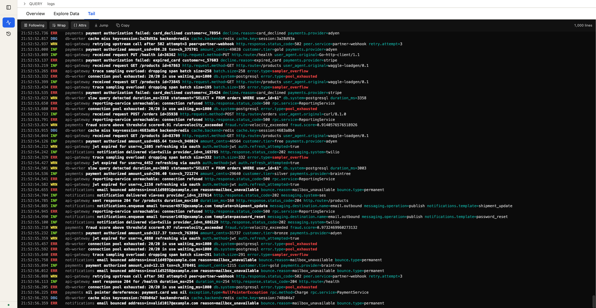

<h1 align="center">waggle</h1>

<p align="center">
  
</p>

<p align="center">
  <strong>OTEL viewer for local development.</strong>
</p>

<p align="center">
  <a href="https://pkg.go.dev/github.com/danielloader/waggle">
    
  </a>
  <a href="https://goreportcard.com/report/github.com/danielloader/waggle">
    
  </a>
  <a href="https://github.com/danielloader/waggle/actions/workflows/ci.yml">
    
  </a>
  <a href="https://github.com/danielloader/waggle/releases/latest">
    
  </a>
  <a href="https://github.com/danielloader/waggle/blob/master/LICENSE">
    
  </a>
</p>


<p align="center">
Local OpenTelemetry viewer inspired by Honeycomb — named for the
  <a href="https://en.wikipedia.org/wiki/Waggle_dance">waggle dance</a> bees
  use to share locations. Run it next to your service, point any OTLP/HTTP
  exporter at <code>http://localhost:4318</code>, and browse a Honeycomb-style
  trace waterfall, log explorer, metrics browser, and structured query
  builder in the same tab.
</p>

- Single static binary — pure Go, no CGO, no Docker required, no Node at runtime.
- OTLP/HTTP ingest (protobuf + JSON) on `POST /v1/traces`, `POST /v1/logs`,
  and `POST /v1/metrics`.
- **Wide-event storage.** All signals land in two SQLite tables — `events`
  (spans + logs, with virtual columns for `signal_type`, `span_kind`, etc.)
  and `metric_events` (Honeycomb-style: the metric's name is an attribute
  field, so `MAX(requests.total)` resolves with plain SQL). WAL mode, FTS5
  for log/span-name search.
- **One unified explore page** driven by a Honeycomb-style query
  builder. Dataset (spans / logs / metrics) is a pill in the URL, so
  the same filters, group-by, and aggregations apply across signals.
- **Per-chart controls.** Multi-`SELECT` queries render one chart per
  aggregation, each with its own Edit-chart popover (missing-values
  handling) and SI-suffixed y-axis.
- Embedded React UI served from the same port.

## Screenshots

The `/traces` Explore-Data tab — root spans for the last hour, filtered
to `is_root = true`. Each row carries a SIGNAL pill, service name,
operation name, duration, status, and a trace-id link that opens the
waterfall. The dataset pill at the top-left switches between
`spans`, `logs`, and `metrics`.


The `/metrics` view with a multi-aggregation query: `MAX(memory.used_bytes)`,
`AVG(cpu.utilization)`, `RATE_AVG(network.bytes_received)` grouped by
`service.name`. Each `SELECT` item gets its own stacked chart with an
independent y-axis (note SI-suffixed labels — `1.4G`, `600m`, `1.2M`)
and a per-chart Edit popover for missing-values handling. The Overview
tab below rolls each aggregation up into a single column. Metric names
are queried as plain attribute fields — Honeycomb-style metric-name-as-field
storage, no separate metric language to learn.


Trace waterfall with the span detail pane open. The right-hand
attributes panel shows the `meta.*` namespace (`meta.dataset`,
`meta.signal_type`, `meta.span_kind`, …) alongside user attributes —
metadata waggle stamps at ingest is queryable like any other field.


The `/logs` Explore-Data tab — FTS5-indexed bodies with severity
badges, service names, and trace-id correlation back to the waterfall.


The logs **Tail** tab — `less`-style focused follow view. Query and
chart collapse out of the way so the feed fills the pane. Lines render
in a zerolog-inspired console format: bold severity pill, white body,
cyan `key=` with logfmt-style values, and bold-red highlights for
common error attributes (`error`, `exception.message`, `exception.type`,
…) on ERROR-level rows. ANSI SGR escapes in log bodies are honoured.
Polls while Following is on; scrolling up pauses follow, Jump resumes.
The Copy button writes the visible buffer to the clipboard as plain
text, ANSI stripped.



**Keyboard shortcuts**, modelled on `less`:

| Key | Action |
| --- | --- |
| `/` | Search (highlight matches — body, attribute keys, attribute values) |
| `&` | Filter (hide non-matching lines; pattern persists when the prompt closes) |
| `n` / `N` | Next / previous match |
| `Enter` / `Shift+Enter` | Same as `n` / `N` while the search prompt is focused |
| `Esc` | Close prompt (search pattern clears; filter pattern is kept) |
| `F` | Toggle Follow (resume tailing) |
| `g` / `G` | Jump to top / bottom |

Both prompts support smart case (lowercase = insensitive, any uppercase
= sensitive) and a `.*` toggle for regex. Filter has an extra `!`
toggle for "show lines that DON'T match". Filter and search compose:
`&pay` narrows to payment lines, then `/declined` highlights card
declines within that view.

## Install

**Binary** — grab a release archive from
[Releases](https://github.com/danielloader/waggle/releases), extract, and run:

```sh
./waggle
```

**Docker** — images are published to GitHub Container Registry:

```sh
docker run --rm -p 4318:4318 -v $(pwd)/data:/data \
  ghcr.io/danielloader/waggle:latest
```

**From source** — requires Go 1.26+ and Node 22+:

```sh
go tool task build
./bin/waggle
```

**`go install`** — headless server only (no embedded UI):

```sh
go install github.com/danielloader/waggle/cmd/waggle@latest
waggle
```

The UI assets are built by Vite and embedded into the binary during the
normal release / `go tool task build` flow. `go install` bypasses that
step, so the resulting binary serves the OTLP/HTTP ingest endpoints and
the `/api/*` surface, but `/` returns "UI not built". Handy for
agent-like deployments where only the ingest + API are needed — and
quick to bootstrap without Node. For the browser UI, use a release
archive, Docker, or a full source build.

Once running, open `http://localhost:4318` and point any OTLP/HTTP exporter
(OpenTelemetry SDK defaults work) at the same URL.

## Usage

One explore page drives everything. The sidebar has two entries — the
explore page and the query history:

- **`/events`** is the single explore surface. A dataset pill in the
  URL picks which signal to query:
  - `dataset=spans` — trace list, Traces tab for top-N slowest roots,
    Explore Data for raw span rows. Clicking a trace-id opens the
    waterfall.
  - `dataset=logs` — FTS5-backed text search on log bodies and span
    names, click-to-drill-into attributes pane.
  - `dataset=metrics` — the metric's name is an attribute field, so
    `MAX(requests.total)` or `P99(memory.used_bytes)` resolves through
    the same field picker as any other attribute.
- **`/history`** — recent queries, deduplicated. Every successful
  `/events` query lands in a local `query_history` table keyed by a
  hash of the AST (time range excluded), so repeats bump a run counter
  rather than pile up new rows. Clicking an entry rehydrates the URL
  and re-runs the query against its original time window.

The paths `/traces`, `/logs`, and `/metrics` exist as redirects into
`/events` with the matching `dataset` preset — handy as short entry
points or legacy links. The specialised trace-waterfall route
`/traces/$traceId` is the one place where the UI leaves the unified
page, because the waterfall's two-column layout doesn't fit the
explore chrome.

Every URL serialises the full query state (filters, group-by, aggregates,
time range, granularity) so shared links reproduce the view.

### Tee logs to a terminal or file

`--tee` mirrors incoming OTLP log records to a second output in a
human-readable format — zerolog-style `console` by default, plus
`logfmt` and `json`. It's a pure passthrough; SQLite is still
authoritative and the UI is unchanged. Handy for two common shapes:

**Watch logs in a terminal while you explore traces + metrics in the
browser.** When a trace in the UI points at a service, you can often
just glance at the tailing terminal to see *that* service's logs scroll
past, without context-switching between panes.

```sh
# Colourised live feed, filtered to two services, WARN+ only
waggle --tee - \
  --tee-service api-gateway,payments \
  --tee-severity warn
```

Colour is `auto` by default — on when stdout is a TTY and the format
is `console`, off otherwise. Use `--tee-color always` if you're piping
to `less -R` / `ccze`, or `never` to strip escapes unconditionally.

**Save logs to disk for later investigation.** For long-running local
sessions, or when you need a durable copy the SQLite retention sweep
(`--retention 24h` by default) won't eventually drop. `logfmt` is
grep/awk-friendly, `json` is jq-friendly.

```sh
# Rolling log file, logfmt (grep/awk-friendly)
waggle --tee logs/waggle.logfmt --tee-format logfmt

# NDJSON — one record per line, point jq at it
waggle --tee logs/waggle.ndjson --tee-format json

# Paginate a live feed through less with ANSI-aware paging
waggle --tee - --tee-color always | less -R
```

Only log records are tee'd; spans and metrics go to SQLite as normal.
The sink is best-effort — a write failure is logged once and the
ingest path keeps going.

### Query model

Following Honeycomb's *Metrics 2.0* mapping, a metric datapoint is an
event whose attribute keys include the metric's name as a field. One
OTel export cycle per `(resource, attribute-set, time_ns)` tuple becomes
one `metric_events` row, with every scalar metric observed at that
moment folded into its attributes JSON. Histograms unpack into
`<name>.p50`, `<name>.p95`, `<name>.p99`, `<name>.sum`, `<name>.count`,
`<name>.min`, `<name>.max` fields on the same folded row.

Meaning you can:

- Group by a metric label with `group_by: ["http.method"]` and chart
  `RATE_SUM(requests.total)` per method.
- Ask for `MAX(memory.rss_bytes) / 1024 / 1024` style arithmetic via the
  query builder's aggregation pipeline.
- Correlate across signals — same `trace_id` filter works on spans and
  logs simultaneously.

## Config

All flags have matching environment variables. Flags take precedence.

| Flag | Env | Default | Notes |
| --- | --- | --- | --- |
| `--db-path` | `WAGGLE_DB` | `./waggle.db` | SQLite file path. |
| `--addr` | `WAGGLE_ADDR` | `127.0.0.1:4318` | Bind address for UI, API, and OTLP ingest. |
| `--ingest-addr` | `WAGGLE_INGEST_ADDR` | — | Override to split OTLP ingest onto its own listener. |
| `--ui-addr` | `WAGGLE_UI_ADDR` | — | Override to split the UI + API onto its own listener. |
| `--no-open-browser` | `WAGGLE_NO_OPEN` | `false` | Skip the browser auto-open on startup. |
| `--retention` | `WAGGLE_RETENTION` | `24h` | Drop data older than this (Go duration; `0` disables). |
| `--log-level` | `WAGGLE_LOG_LEVEL` | `info` | `debug`, `info`, `warn`, `error`. |
| `--dev` | — | `false` | Dev mode: do not serve embedded UI, do not open browser. |
| `--tee` | `WAGGLE_TEE` | — | Mirror incoming log records to this path (`-` = stdout). See the Tee section above. |
| `--tee-service` | `WAGGLE_TEE_SERVICE` | — | Comma-separated `service.name` allow-list. Omit for all services. |
| `--tee-severity` | `WAGGLE_TEE_SEVERITY` | — | Severity floor: `trace`, `debug`, `info`, `warn`, `error`, `fatal`. |
| `--tee-format` | `WAGGLE_TEE_FORMAT` | `console` | `console` (zerolog-style), `logfmt`, or `json` (NDJSON). |
| `--tee-color` | `WAGGLE_TEE_COLOR` | `auto` | ANSI colour for `console` format: `auto` (TTY-detect), `always`, `never`. |

When `--ingest-addr` and `--ui-addr` differ, waggle binds two HTTP listeners;
otherwise a single listener serves everything on `--addr`.

## Development

```sh
# Go (hot-reload via air) + Vite dev server, concurrently.
# Go listens on :4318, Vite on :5173 with /v1 and /api proxied to Go.
go tool task dev
```

One-time prerequisites:

```sh
go install github.com/air-verse/air@latest
(cd ui && npm install)
```

Tasks are defined in `Taskfile.yml` and run via
[go-task](https://taskfile.dev), which is pinned as a module-local tool in
`go.mod` — no system install needed. Run `go tool task` with no arguments to
list every target.

Useful targets:

| Task | What it does |
| --- | --- |
| `go tool task build` | Build the UI and compile a single static binary into `bin/waggle`. |
| `go tool task test` | Run Go and UI tests. |
| `go tool task typecheck` | `tsc --noEmit` + `go vet`. |
| `go tool task fmt` | `gofmt` + `goimports` on Go sources. |
| `go tool task loadgen -- --rate 20` | Stream realistic OTel traces / logs / metrics at a running waggle. |
| `go tool task release:snapshot` | Local goreleaser snapshot (archives + Docker image, no publish). |

## Loadgen

`cmd/loadgen` is a small OTel client that drives realistic trace / log /
metric traffic at a running waggle. It uses the real OTel Go SDK
(`otlptracehttp`, `otlploghttp`, `otlpmetrichttp`), so the resulting
payloads exercise the full ingest path.

```sh
# Default: 5 traces/s, no logs, metrics every second
go tool task loadgen

# Metrics only, one export every 10s — good for building up a tidy chart
go tool task loadgen -- --rate 0 --logs-rate 0 --metrics-rate 0 --metrics-interval 10s
```

Metrics emitted per service cover the common host-metrics shapes so
queries like `MAX(memory.rss_bytes)` and `AVG(cpu.utilization)` have
something to chart: `requests.total` (counter), `memory.used_bytes`,
`memory.free_bytes`, `memory.rss_bytes` (gauges), `cpu.utilization`
(gauge, two cpus), `network.bytes_sent`, `network.bytes_received`
(observable counters). Each gauge wobbles deterministically around a
per-service baseline.

Useful flags (`go tool task loadgen -- --help` for the full list):

- `--rate` / `--logs-rate` / `--metrics-rate` — independent rate knobs
  (set any to `0` to disable that signal).
- `--metrics-interval` — the OTel PeriodicReader cadence.
- `--services` — comma-separated subset of trace templates.

## Project layout

```text
cmd/
  waggle/       # server entry point
  loadgen/      # OTel trace load generator (real OTel SDK)
internal/
  api/          # JSON API for the UI (/api/*)
  config/       # flag + env parsing
  ingest/       # OTLP/HTTP decode + buffered writer
  otlp/         # OTLP -> internal model transform
  query/        # structured query builder (validates + compiles to SQL)
  server/       # HTTP wiring (ingest + UI/API listeners)
  store/        # storage seam + SQLite implementation (schema, queries)
  ui/           # embedded React build (//go:embed all:dist)
ui/             # Vite + React + TanStack Router + Tailwind source
```
