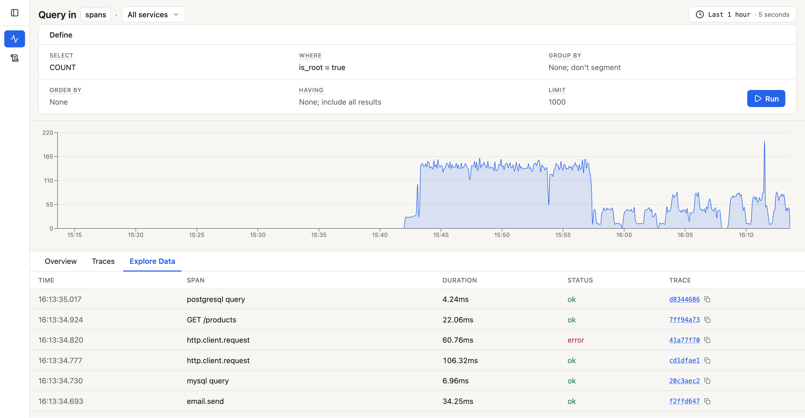
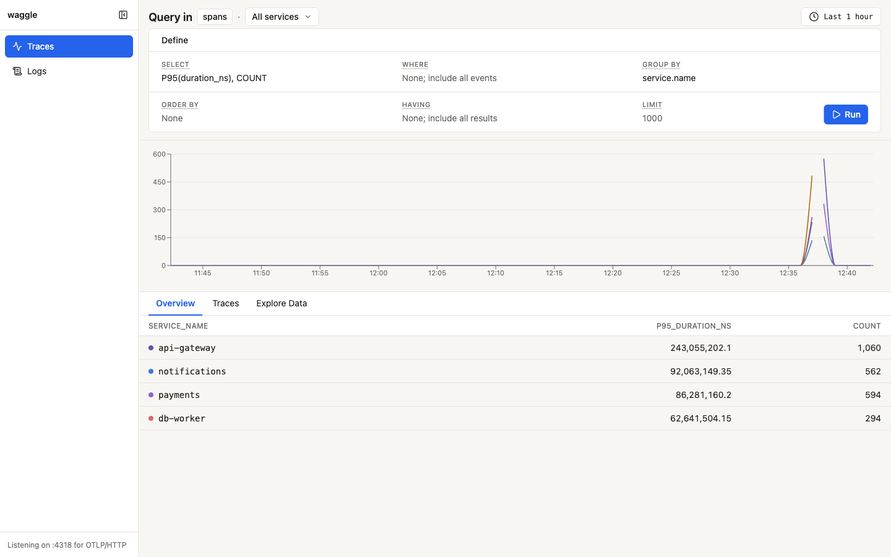
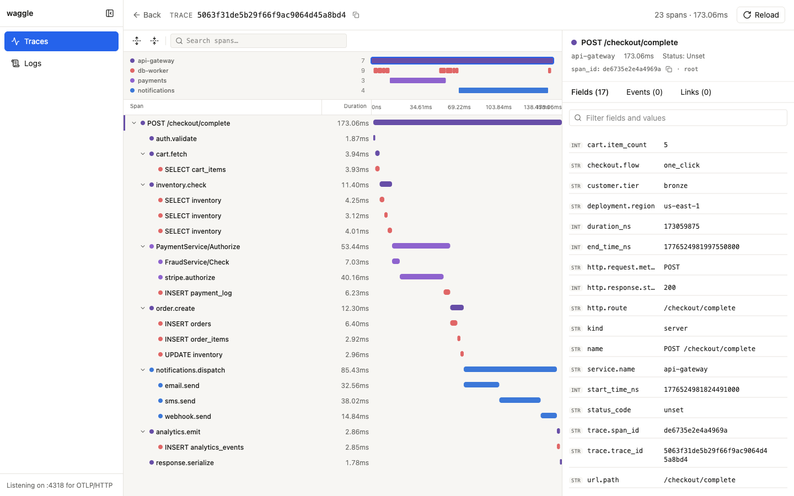
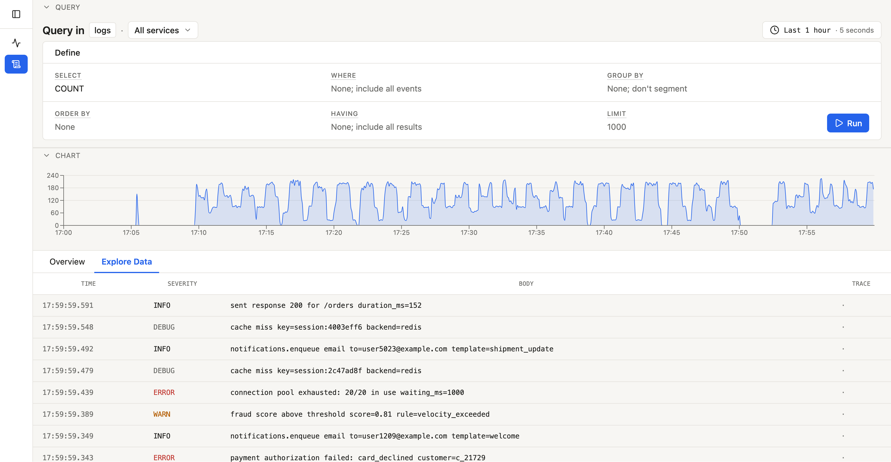

# waggle

Local OpenTelemetry viewer inspired by Honeycomb — named for the
[waggle dance](https://en.wikipedia.org/wiki/Waggle_dance) bees use to share
locations. Run it next to your service, point any OTLP/HTTP exporter at
`http://localhost:4318`, and browse a Honeycomb-style trace waterfall, log
explorer, metrics browser, and structured query builder in the same tab.

- Single static binary — pure Go, no CGO, no Docker required, no Node at runtime.
- OTLP/HTTP ingest (protobuf + JSON) on `POST /v1/traces`, `POST /v1/logs`,
  and `POST /v1/metrics`.
- **Wide-event storage.** All signals land in two SQLite tables — `events`
  (spans + logs, with virtual columns for `signal_type`, `span_kind`, etc.)
  and `metric_events` (Honeycomb-style: the metric's name is an attribute
  field, so `MAX(requests.total)` resolves with plain SQL). WAL mode, FTS5
  for log/span-name search.
- **Four peer surfaces:** `/traces`, `/logs`, `/metrics`, and `/events`
  (cross-signal) — each driven by the same Honeycomb-style query builder.
- **Per-chart controls.** Multi-`SELECT` queries render one chart per
  aggregation, each with its own Edit-chart popover (missing-values
  handling) and SI-suffixed y-axis.
- Embedded React UI served from the same port.

## Screenshots

The `/traces` Explore-Data tab — root spans for the last hour, filtered
to `is_root = true`. Each row carries a SIGNAL pill, service name,
operation name, duration, status, and a trace-id link that opens the
waterfall. The dataset pill at the top-left switches between
`spans`, `logs`, `metrics`, and the cross-signal `events` view.



The `/metrics` view with a multi-aggregation query: `MAX(memory.used_bytes)`,
`AVG(cpu.utilization)`, `RATE_AVG(network.bytes_received)` grouped by
`service.name`. Each `SELECT` item gets its own stacked chart with an
independent y-axis (note SI-suffixed labels — `1.4G`, `600m`, `1.2M`)
and a per-chart Edit popover for missing-values handling. The Overview
tab below rolls each aggregation up into a single column. Metric names
are queried as plain attribute fields — Honeycomb-style metric-name-as-field
storage, no separate metric language to learn.



Trace waterfall with the span detail pane open. The right-hand
attributes panel shows the `meta.*` namespace (`meta.dataset`,
`meta.signal_type`, `meta.span_kind`, …) alongside user attributes —
metadata waggle stamps at ingest is queryable like any other field.



The `/logs` Explore-Data tab — FTS5-indexed bodies with severity
badges, service names, and trace-id correlation back to the waterfall.



## Install

**Binary** — grab a release archive from
[Releases](https://github.com/danielloader/waggle/releases), extract, and run:

```sh
./waggle
```

**Docker** — images are published to GitHub Container Registry:

```sh
docker run --rm -p 4318:4318 -v $(pwd)/data:/data \
  ghcr.io/danielloader/waggle:latest
```

**From source** — requires Go 1.26+ and Node 22+:

```sh
go tool task build
./bin/waggle
```

Once running, open `http://localhost:4318` and point any OTLP/HTTP exporter
(OpenTelemetry SDK defaults work) at the same URL.

## Usage

Four peer routes, all driven by the same query builder:

- `/traces` — span-scoped view (dataset = `spans`). Trace list, Traces
  tab showing top-N slowest roots, Explore Data for raw span rows.
  Clicking a trace-id opens the waterfall.
- `/logs` — log-scoped view (dataset = `logs`). FTS5-backed text search
  on log bodies and span names.
- `/metrics` — metric-scoped view (dataset = `metrics`). The metric's
  name is an attribute field, so you query it the same way as any other
  field: type `MAX(requests.total)` or `P99(memory.used_bytes)` in the
  Select cell. Field autocomplete pulls metric names from the attribute
  catalog.
- `/events` — cross-signal view. Runs with no signal-type prefix, so
  one query can slice across spans, logs, and metrics.

Every URL serialises the full query state (filters, group-by, aggregates,
time range, granularity) so shared links reproduce the view.

### Query model

Following Honeycomb's *Metrics 2.0* mapping, a metric datapoint is an
event whose attribute keys include the metric's name as a field. One
OTel export cycle per `(resource, attribute-set, time_ns)` tuple becomes
one `metric_events` row, with every scalar metric observed at that
moment folded into its attributes JSON. Histograms unpack into
`<name>.p50`, `<name>.p95`, `<name>.p99`, `<name>.sum`, `<name>.count`,
`<name>.min`, `<name>.max` fields on the same folded row.

Meaning you can:

- Group by a metric label with `group_by: ["http.method"]` and chart
  `RATE_SUM(requests.total)` per method.
- Ask for `MAX(memory.rss_bytes) / 1024 / 1024` style arithmetic via the
  query builder's aggregation pipeline.
- Correlate across signals — same `trace_id` filter works on spans and
  logs simultaneously.

## Config

All flags have matching environment variables. Flags take precedence.

| Flag | Env | Default | Notes |
| --- | --- | --- | --- |
| `--db-path` | `WAGGLE_DB` | `./waggle.db` | SQLite file path. |
| `--addr` | `WAGGLE_ADDR` | `127.0.0.1:4318` | Bind address for UI, API, and OTLP ingest. |
| `--ingest-addr` | `WAGGLE_INGEST_ADDR` | — | Override to split OTLP ingest onto its own listener. |
| `--ui-addr` | `WAGGLE_UI_ADDR` | — | Override to split the UI + API onto its own listener. |
| `--no-open-browser` | `WAGGLE_NO_OPEN` | `false` | Skip the browser auto-open on startup. |
| `--retention` | `WAGGLE_RETENTION` | `24h` | Drop data older than this (Go duration; `0` disables). |
| `--log-level` | `WAGGLE_LOG_LEVEL` | `info` | `debug`, `info`, `warn`, `error`. |
| `--dev` | — | `false` | Dev mode: do not serve embedded UI, do not open browser. |

When `--ingest-addr` and `--ui-addr` differ, waggle binds two HTTP listeners;
otherwise a single listener serves everything on `--addr`.

## Development

```sh
# Go (hot-reload via air) + Vite dev server, concurrently.
# Go listens on :4318, Vite on :5173 with /v1 and /api proxied to Go.
go tool task dev
```

One-time prerequisites:

```sh
go install github.com/air-verse/air@latest
(cd ui && npm install)
```

Tasks are defined in `Taskfile.yml` and run via
[go-task](https://taskfile.dev), which is pinned as a module-local tool in
`go.mod` — no system install needed. Run `go tool task` with no arguments to
list every target.

Useful targets:

| Task | What it does |
| --- | --- |
| `go tool task build` | Build the UI and compile a single static binary into `bin/waggle`. |
| `go tool task test` | Run Go and UI tests. |
| `go tool task typecheck` | `tsc --noEmit` + `go vet`. |
| `go tool task fmt` | `gofmt` + `goimports` on Go sources. |
| `go tool task loadgen -- --rate 20` | Stream realistic OTel traces / logs / metrics at a running waggle. |
| `go tool task release:snapshot` | Local goreleaser snapshot (archives + Docker image, no publish). |

## Loadgen

`cmd/loadgen` is a small OTel client that drives realistic trace / log /
metric traffic at a running waggle. It uses the real OTel Go SDK
(`otlptracehttp`, `otlploghttp`, `otlpmetrichttp`), so the resulting
payloads exercise the full ingest path.

```sh
# Default: 5 traces/s, no logs, metrics every second
go tool task loadgen

# Metrics only, one export every 10s — good for building up a tidy chart
go tool task loadgen -- --rate 0 --logs-rate 0 --metrics-rate 0 --metrics-interval 10s
```

Metrics emitted per service cover the common host-metrics shapes so
queries like `MAX(memory.rss_bytes)` and `AVG(cpu.utilization)` have
something to chart: `requests.total` (counter), `memory.used_bytes`,
`memory.free_bytes`, `memory.rss_bytes` (gauges), `cpu.utilization`
(gauge, two cpus), `network.bytes_sent`, `network.bytes_received`
(observable counters). Each gauge wobbles deterministically around a
per-service baseline.

Useful flags (`go tool task loadgen -- --help` for the full list):

- `--rate` / `--logs-rate` / `--metrics-rate` — independent rate knobs
  (set any to `0` to disable that signal).
- `--metrics-interval` — the OTel PeriodicReader cadence.
- `--services` — comma-separated subset of trace templates.

## Project layout

```text
cmd/
  waggle/       # server entry point
  loadgen/      # OTel trace load generator (real OTel SDK)
internal/
  api/          # JSON API for the UI (/api/*)
  config/       # flag + env parsing
  ingest/       # OTLP/HTTP decode + buffered writer
  otlp/         # OTLP -> internal model transform
  query/        # structured query builder (validates + compiles to SQL)
  server/       # HTTP wiring (ingest + UI/API listeners)
  store/        # storage seam + SQLite implementation (schema, queries)
  ui/           # embedded React build (//go:embed all:dist)
ui/             # Vite + React + TanStack Router + Tailwind source
```
